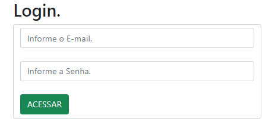
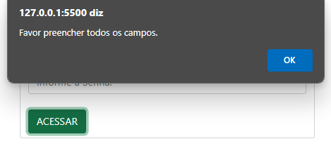
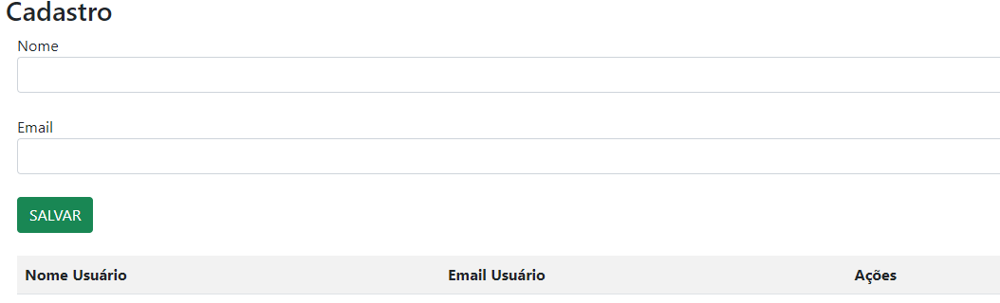
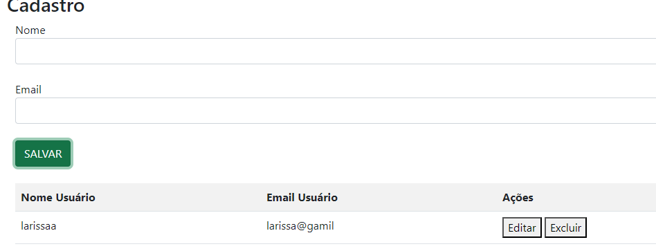
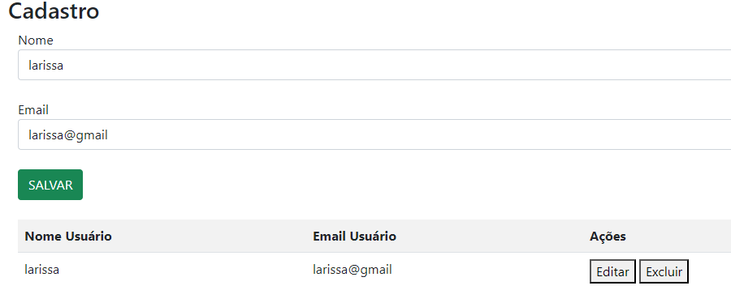
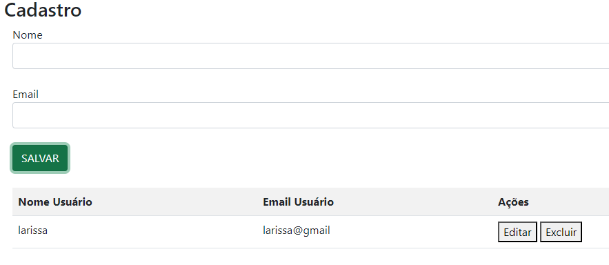

# CADASTRO DE USUÁRIOS.

## Começando 🚀
Nesse projeto, foi criado uma Tela de Login e uma tela de Cadastro de Usuários na seguinte matéria:
* Programação Web I.

## Sobre o projeto 📋 

Esse projeto é composto por 2 páginas, uma contendo a Tela de Login e a outra a tela de Cadastro de Usuários. Neste README inclui o uso de fotos pois assim fica de uma forma mais fácil de ser entendido, não sendo uma leitura muito complexa e o site tornando-se bem fácil de ser utilizado. Após isso, adicionei o campo E-mail.

## Código JavaScript da Tela de Login.
* ``let`` : Declara uma variável local na extensão do bloco atual, opcionalmente iniciando-a com um valor.
* ``loginSenha`` : ``loginSenha`` e ``loginEmail`` são id´s (identificadores) que utilizo para chamar no js, assim, consigo editar o código. 
* ``document.getElementById`` : Retorna a referência do elemento através do seu ID.
* ``value`` : ``value`` é o valor do input.
* ``if & else`` : A condicional if é uma estrutura que executa a afirmação, dentro do bloco, se determinada condição for verdadeira. Se for falsa, executa as afirmações dentro de else.
* ``window.location.href`` : O ``window.location.href`` é usado para redirecionar o usuário para uma nova página após a conclusão bem-sucedida de um envio de vídeo.

## Código JavaScript do Cadastro de Usuários.
* ``var`` : O ``var`` declara uma variável, opcionalmente é possível atribuir à ela um valor em sua inicialização.
* ``function`` : Funções em JavaScript são blocos fundamentais que executam tarefas ou calculam valores, recebendo entradas e retornando saídas. Elas devem ser definidas no escopo em que serão chamadas.
* ``inner.HTML`` : A propriedade ``innerHTML`` obtém ou define a marcação HTML ou XML contida no elemento.
* ``splice`` : Altera o conteúdo de uma lista, adicionando novos elementos enquanto remove elementos antigos.
* ``deleteRow`` : Remove a linha em específico do código.

## Técnicas e Tecnologias utilizadas 🔨
* Visual Studio Code 
* Git Bash
* Git Hub
* HTML5
* CSS3
* JavaScript
* Live Server (A extensão Live Server permite criar um servidor local através do VSCode. Com ele é cortado a necessidade de sempre que fizer uma alteração no código atualizar o navegador.)

# Fotos projeto.

  
Essa é a tela inicial, tela de login.  
  
Mensagem que aparece quando só é preenchido apenas um campo.

Essa é a tela de cadastro, após ser preenchido todos os campos da tela de login.

Essa foto é um exemplo de erro, escrevi meu nome e o e-mail errados (coloquei com 2 A no final e escrevi gmail errado) e apertei em salvar.

Nessa imagem, temos o meu nome editado, apertei no botão "Editar" (que aparece na foto), assim, deixando meu nome certo.

Apertei em salvar, agora sim meu nome está certo, mas não era pra ter salvado meu nome! e agora?

Problema solucionado, botão "Excluir" está funcionando maravilhosamente bem.

## Autores ✍🏻
| [ Larissa Gabrielle Fagundes Andrade.](https://github.com/gabriellefagundes) |
| :---: 
## Meu LinkedIn:
|  [ LinkedIn.](https://www.linkedin.com/in/larissa-gabrielle-a74a272b3/)
| :---: 